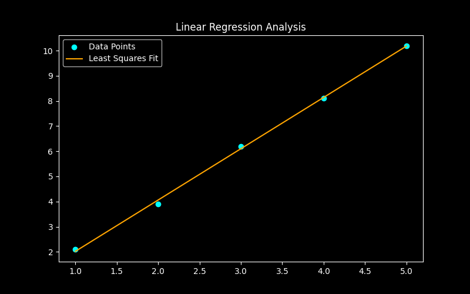

<div align="center">

<h1>⚙️ NumCore</h1>
<p><strong>Unified Numerical Engineering &amp; Simulation Suite</strong></p>

<p>
  <a href="https://www.python.org/downloads/release/python-3100/">
    
  </a>
  <a href="https://github.com/4awmy/NUM-CORE/actions">
    
  </a>
  <a href="LICENSE">
    
  </a>
  <a href="https://github.com/4awmy/NUM-CORE">
    
  </a>
</p>

<p>
  A modular, dual-interface Python suite implementing <strong>20+ numerical methods</strong> — from root finding to ODEs — featuring a beautiful Rich TUI and a full CustomTkinter GUI dashboard with live Matplotlib plots.
</p>

</div>

---

## 📖 About

**NumCore** is a comprehensive numerical engineering toolkit developed as part of the *Numerical Methods* course at the **Arab Academy for Science, Technology & Maritime Transport (AAST)**. It implements over 20 classical numerical algorithms across six domains: root finding, linear systems, interpolation, differentiation, integration, curve fitting, and ODEs.

What sets NumCore apart is its strictly clean architecture — a pure computation engine (`numcore_engine/`) is completely decoupled from the interfaces, allowing the exact same solvers to power both a terminal-first Rich TUI and a modern CustomTkinter GUI dashboard with live Matplotlib visualizations. Users can launch either interface from a single unified entry point.

---

## 📸 Screenshots

<div align="center">

| Calculus Plot | Convergence Graph | Regression Plot |
|:---:|:---:|:---:|
|  |  |  |
| *Integration rules with visual bounds* | *Iterative solver convergence* | *Curve fitting & regression overlay* |

</div>

---

## ✨ Features & Solvers

### 📌 Chapter 1 — Root Finding

| Solver | Description |
|--------|-------------|
| **Bisection Method** | Bracket-based root isolation; guaranteed convergence on continuous functions |
| **Newton-Raphson Method** | Derivative-driven quadratic convergence; fast for smooth functions |
  | **Secant Method** | Derivative-free quasi-Newton method using two initial points |
| **Simple Fixed-Point Iteration** | Iterative $x = g(x)$ form; convergence depends on $|g'(x)| < 1$ |

### 📌 Chapter 2 — Linear Systems

| Solver | Description |
|--------|-------------|
| **Gauss-Seidel** | Iterative method; uses the latest available values at each step |
| **Jacobi Method** | Simultaneous iterative updates; ideal for diagonally dominant systems |
| **Diagonal Dominance Check** | Automatic detection + row swapping to ensure convergence preconditions |

### 📌 Chapter 3 — Interpolation

| Solver | Description |
|--------|-------------|
| **Lagrange Interpolation** | Global polynomial fit through $n+1$ data points |
| **Newton Forward Difference** | Efficient polynomial interpolation on equally-spaced points |
| **Newton Divided Difference** | Generalized Newton form for arbitrarily-spaced data |
| **Linear Spline** | Piecewise linear interpolation; fast and lightweight |
| **Cubic Spline** | Smooth piecewise-cubic interpolation with continuous second derivatives |

### 📌 Chapter 4 — Numerical Calculus

#### Differentiation

| Method | Description |
|--------|-------------|
| **Forward Difference** | First-order approximation: $f'(x) \approx \frac{f(x+h)-f(x)}{h}$ |
| **Backward Difference** | Backward-looking first-order approximation |
| **Central Difference** | Second-order symmetric approximation; higher accuracy |

#### Integration

| Method | Description |
|--------|-------------|
| **Midpoint Rule** | Basic + composite rectangle integration using midpoints |
| **Trapezoidal Rule** | Basic + composite trapezoidal approximation |
| **Simpson's 1/3 Rule** | Parabolic approximation; requires even number of subintervals |
| **Simpson's 3/8 Rule** | Cubic approximation; requires subintervals divisible by 3 |
| **Gaussian Quadrature (2-pt)** | Exact for polynomials up to degree 3 using optimal node placement |
| **Gaussian Quadrature (3-pt)** | Exact for polynomials up to degree 5 |

### 🎁 Bonus Modules

#### Curve Fitting

| Method | Description |
|--------|-------------|
| **Least Squares** | General linear regression minimizing sum of squared residuals |
| **Linear Regression** | Fit $y = ax + b$ to data |
| **Quadratic Regression** | Fit $y = ax^2 + bx + c$ |
| **Power Regression** | Fit $y = ax^b$ via log-linearization |
| **Exponential Regression** | Fit $y = ae^{bx}$ |
| **Growth Regression** | Fit $y = ab^x$ growth model |

#### Ordinary Differential Equations (ODEs)

| Method | Description |
|--------|-------------|
| **Euler's Method** | First-order explicit time-stepping |
| **Modified Euler (Heun)** | Predictor-corrector; second-order accuracy |
| **Runge-Kutta (RK4)** | Fourth-order gold-standard ODE solver |
| **Taylor Series (Order 4)** | Derivative-expansion method up to 4th order |

---

## 🖥️ Dual Interface

NumCore ships with **two complete, independent interfaces** — both powered by the same `numcore_engine` under the hood.

<div align="center">

| | 🖤 TUI (Terminal) | 🪟 GUI (Dashboard) |
|---|---|---|
| **Library** | [Rich](https://github.com/Textualize/rich) | [CustomTkinter](https://github.com/TomSchimansky/CustomTkinter) |
| **Visualization** | ASCII tables & progress bars | Matplotlib live plots |
| **Best for** | SSH sessions, scripting, power users | Interactive exploration, presentations |
| **Launch** | `python main.py --tui` | `python main.py --gui` |

</div>

The **Unified Startup Selector** launches when no flag is given, letting users choose their preferred interface interactively. Both interfaces support **CSV export** of calculation steps and intermediate results.

---

## 🏗️ Architecture

NumCore follows a strict **three-layer modular architecture**, keeping math logic completely isolated from presentation.

```
NUM-CORE/
│
├── numcore_engine/          # 🧮 Pure math — zero UI dependencies
│   ├── root_finding/        #    Bisection, Newton-Raphson, Secant, Fixed-Point
│   ├── linear_systems/      #    Gauss-Seidel, Jacobi, dominance checking
│   ├── interpolation/       #    Lagrange, Newton FD/DD, Splines
│   ├── differentiation/     #    Forward, Backward, Central difference
│   ├── integration/         #    Midpoint, Trapezoidal, Simpson, Gauss
│   ├── curve_fitting/       #    Least Squares, Linear, Quadratic, Power, Exp
│   └── odes/                #    Euler, Heun, RK4, Taylor
│
├── numcore_cli/             # 🖤 Rich TUI — terminal interface layer
│   └── ...                  #    Menus, tables, Rich panels, spinner prompts
│
├── numcore_gui/             # 🪟 GUI dashboard — CustomTkinter + Matplotlib
│   └── ...                  #    Frames, input forms, live plot canvases
│
├── docs/                    # 📚 Documentation & screenshots
│   ├── ARCHITECTURE.md
│   ├── ENGINE_MODULES.md
│   ├── GUI_GUIDE.md
│   └── screenshots/
│
├── tests/                   # 🧪 pytest test suite
├── main.py                  # 🚀 Unified entry point
└── requirements.txt
```

> **Design principle:** `numcore_engine` has **no imports** from `numcore_cli` or `numcore_gui`. Either interface layer can be swapped or extended without touching a single solver.

---

## ⚡ Tech Stack

<div align="center">

| Technology | Role | Badge |
|------------|------|-------|
| **Python 3.10+** | Core language |  |
| **Rich** | TUI terminal interface |  |
| **CustomTkinter** | GUI dashboard framework |  |
| **Matplotlib** | Plotting & visualization |  |
| **NumPy** | Numerical arrays & math |  |
| **SciPy** | Advanced numerical routines |  |
| **pytest** | Testing framework |  |

</div>

---

## 🚀 Installation

**1. Clone the repository**

```bash
git clone https://github.com/4awmy/NUM-CORE.git
cd NUM-CORE
```

**2. Create and activate a virtual environment** *(recommended)*

```bash
# Windows
python -m venv venv
venv\Scripts\activate

# macOS / Linux
python -m venv venv
source venv/bin/activate
```

**3. Install dependencies**

```bash
pip install -r requirements.txt
```

> **Requirements:** Python 3.10 or higher is required.

---

## 📦 Usage

```bash
# Launch the unified startup selector (choose TUI or GUI interactively)
python main.py

# Force the Rich TUI interface directly
python main.py --tui

# Force the CustomTkinter GUI dashboard directly
python main.py --gui

# Run the full test suite
python -m pytest

# Run tests with verbose output
python -m pytest -v
```

---

## 📚 Documentation

| Document | Description |
|----------|-------------|
| [ARCHITECTURE.md](docs/ARCHITECTURE.md) | Deep dive into the three-layer module design |
| [ENGINE_MODULES.md](docs/ENGINE_MODULES.md) | Full API reference for all solver functions |
| [GUI_GUIDE.md](docs/GUI_GUIDE.md) | GUI dashboard walkthrough and usage tips |

---

## 👤 Author

<div align="center">

**Omar Hossam**
*Student — Computer Engineering*
Arab Academy for Science, Technology & Maritime Transport (AAST)

*Numerical Methods Course Project · Spring 2025*

[](https://github.com/4awmy)

</div>

---

## 📄 License

This project is licensed under the **MIT License** — see the [LICENSE](LICENSE) file for details.

```
MIT License — Copyright (c) 2025 Omar Hossam
Permission is hereby granted, free of charge, to any person obtaining a copy
of this software and associated documentation files (the "Software"), to deal
in the Software without restriction...
```

---

<div align="center">

*Built with 🖤 and a lot of numerical analysis for AAST Numerical Methods.*

</div>
