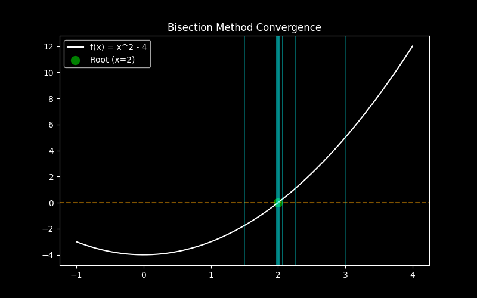
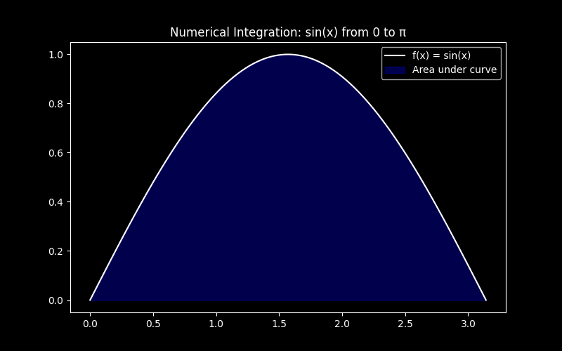

# NUM-CORE: Unified Numerical Engineering & Simulation Suite

🚀 **Modern Engineering CLI & High-Fidelity Visualization Dashboard**

NUM-CORE is a professional-grade numerical computation suite designed for engineering students and professionals. It provides a dual-interface experience: a powerful, interactive Command Line Interface (CLI) for rapid calculations and a modern Graphical User Interface (GUI) for data-heavy simulations and trajectory visualizations.

---

## 📋 Key Features (Wave 2.0)

NUM-CORE now includes over 20+ solvers, fully synchronized across both TUI and GUI modes, with advanced features like CSV export and a unified startup selector.

### Chapter 1: Root Finding Engine
Solve complex non-linear equations $f(x) = 0$ with high precision.
- **Bisection Method**: Robust bracketing method.
- **Newton-Raphson Method**: Rapid convergence using derivatives.
- **Secant Method**: Fast convergence without analytical derivatives.
- **Simple Iteration**: Fixed-point iteration method.

### Chapter 2: Linear Systems
Solve systems of linear equations $Ax = b$, essential for circuit analysis and structural engineering.
- **Gauss-Seidel Solver**: Robust successive iterative method.
- **Jacobi Solver**: Simultaneous iterative method.
- *Includes Automatic Diagonal Dominance checking and row swapping.*

### Chapter 3: Interpolation
Analyze experimental data and perform polynomial fitting.
- **Lagrange's Interpolation**: Classic polynomial fitting.
- **Newton Forward Difference**: For equispaced data points.
- **Newton Divided Difference**: For unevenly spaced data points.
- **Linear & Cubic Spline Interpolation**: Advanced piecewise fitting.

### Chapter 4: Numerical Calculus
Perform numerical integration and differentiation.
- **Numerical Differentiation**: Forward, Backward, and Central difference methods.
- **Midpoint Rule**: Basic and composite integration.
- **Trapezoidal Rule**: Basic and composite integration.
- **Simpson's Rules**: 1/3 and 3/8 rules for higher accuracy.
- **Gaussian Quadrature**: 2-point and 3-point methods for optimal precision.

### Advanced Modules (Bonus)
- **Curve Fitting (Regression)**: Least Squares, Linear, Quadratic, Power, Exponential, and Growth models.
- **Ordinary Differential Equations (ODEs)**: Euler, Modified Euler (Heun), Runge-Kutta (RK4), and Taylor Series (Order 4).

### System Features
- **Unified Startup Selector**: Choose between TUI and GUI at launch.
- **CSV Data Export**: Export calculation steps and results to CSV for external analysis.
- **Dual Interfaces**: 
  - **TUI**: High-performance terminal interface using `Rich`.
  - **GUI**: Modern desktop dashboard built with `CustomTkinter` and `Matplotlib`.

---

## 🛠️ Installation

### Prerequisites
- Python 3.10 or higher
- `pip` (Python package installer)

### Setup
1. **Clone the repository**:
   ```bash
   git clone https://github.com/4awmy/NUM-CORE.git
   cd NUM-CORE
   ```

2. **Create a virtual environment** (recommended):
   ```bash
   python -m venv .venv
   # On Windows:
   .venv\Scripts\activate
   # On macOS/Linux:
   source .venv/bin/activate
   ```

3. **Install dependencies**:
   ```bash
   pip install -r requirements.txt
   ```

---

## 🏷️ Topics & Tags
`numerical-methods` `python` `engineering` `mathematics` `simulation` `root-finding` `linear-algebra` `interpolation` `calculus` `regression` `ode-solver` `customtkinter` `matplotlib` `cli` `desktop-app`

---

## 🖥️ Usage

NUM-CORE provides a unified entry point. Run the main script to launch the startup selector:

```bash
python main.py
```

You can also bypass the selector using command-line flags:

### Terminal User Interface (TUI)
For rapid, text-based calculations:
```bash
python main.py --tui
```

### Graphical User Interface (GUI)
For visual analysis and interactive plotting:
```bash
python main.py --gui
```

---

## 📸 Screenshots

| CLI Main Menu | GUI Dashboard |
| :---: | :---: |
|  |  |

| Root Finding Convergence | Calculus Visualization |
| :---: | :---: |
|  |  |

---

## 🧪 Development & Testing

The project uses `pytest` for unit and contract testing to ensure solver reliability.

To run the test suite:
```bash
python -m pytest
```

---

## 🏗️ Architecture

NUM-CORE is built with a strictly modular architecture that decouples mathematical logic from user interfaces.

- **`numcore_engine/`**: The core mathematical engine. Includes solvers for root-finding, linear systems, calculus, regression, and ODEs.
- **`numcore_cli/`**: A high-performance terminal interface using `Rich`.
- **`numcore_gui/`**: A modern dashboard built with `CustomTkinter` and `Matplotlib`.

For a deep dive into the system design, see:
- 📘 [Architecture Overview](docs/ARCHITECTURE.md)
- 🔬 [Engine & Solvers Guide](docs/ENGINE_MODULES.md)
- 🎨 [GUI Structure & Theme](docs/GUI_GUIDE.md)

---

## 🎓 Credits
Developed as part of the **Numerical Methods** course.

**Author**: Omar Hossam
**License**: MIT
