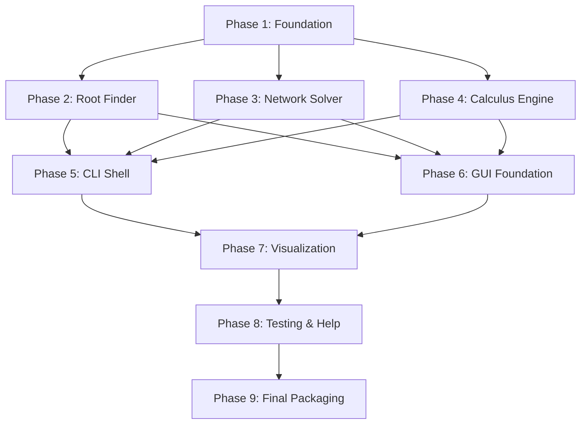

# NUM-CORE: Unified Numerical Engineering & Simulation Suite - Implementation Plan

## 1. Plan Overview
NUM-CORE is a modular engineering suite featuring a core numerical engine, a professional CLI, and a high-fidelity GUI dashboard. This plan decomposes the project into 9 phases across foundation, core domain, UI interfaces, and quality assurance.

- **Total Phases**: 9
- **Agents Involved**: `architect`, `coder`, `tester`, `ux_designer`, `technical_writer`
- **Estimated Effort**: High

## 2. Dependency Graph

## 3. Execution Strategy Table

| Stage | Phases | Mode | Agent(s) |
|-------|--------|------|----------|
| 1: Foundation | 1 | Sequential | `architect` |
| 2: Core Domain | 2, 3, 4 | Parallel | `coder`, `coder`, `coder` |
| 3: UI Interfaces | 5, 6 | Parallel | `coder`, `ux_designer` |
| 4: Integration | 7 | Sequential | `ux_designer` |
| 5: Quality | 8 | Sequential | `tester` |
| 6: Delivery | 9 | Sequential | `technical_writer` |

## 4. Phase Details

### Phase 1: Foundation
- **Objective**: Setup `numcore_engine` package, `Solver` protocol, and shared data models.
- **Agent**: `architect`
- **Files to Create**:
  - `numcore_engine/__init__.py`: Package entry.
  - `numcore_engine/interfaces.py`: `Solver` protocol (solve, get_steps, validate_input).
  - `numcore_engine/models.py`: `SimulationData` and `NumericalStep` data classes.
  - `numcore_engine/parser.py`: Symbolic parsing logic using `sympy`.
- **Validation**: `python -m pytest tests/unit/test_foundation.py` (to be created).
- **Dependencies**: None.

### Phase 2: Root Finder (Parallel)
- **Objective**: Implement Newton-Raphson and Simple Iteration solvers.
- **Agent**: `coder`
- **Files to Create**:
  - `numcore_engine/solvers/root_finder.py`: Implementation of `NewtonRaphsonSolver` and `SimpleIterationSolver`.
- **Validation**: `python -m pytest tests/unit/test_root_finder.py`.
- **Dependencies**: Blocked by Phase 1.

### Phase 3: Network Solver (Parallel)
- **Objective**: Implement Gauss-Seidel with diagonal dominance check and row-swapping.
- **Agent**: `coder`
- **Files to Create**:
  - `numcore_engine/solvers/network_solver.py`: Implementation of `GaussSeidelSolver`.
- **Validation**: `python -m pytest tests/unit/test_network_solver.py`.
- **Dependencies**: Blocked by Phase 1.

### Phase 4: Calculus Engine (Parallel)
- **Objective**: Implement Newton's Divided Difference and Simpson's/Trapezoidal integration.
- **Agent**: `coder`
- **Files to Create**:
  - `numcore_engine/solvers/calculus_engine.py`: Implementation of `InterpolationSolver` and `IntegrationSolver`.
- **Validation**: `python -m pytest tests/unit/test_calculus_engine.py`.
- **Dependencies**: Blocked by Phase 1.

### Phase 5: CLI Shell (Parallel)
- **Objective**: Build the robust `rich`-based CLI with step-by-step output formatting.
- **Agent**: `coder`
- **Files to Create**:
  - `numcore_cli/terminal.py`: Menu system and input handlers.
  - `numcore_cli/formatter.py`: Step-by-step table generators using `rich`.
- **Files to Modify**:
  - `main.py`: Refactor to launch the new CLI or GUI.
- **Validation**: Manual verification of menu flow and numerical output.
- **Dependencies**: Blocked by Phases 2, 3, 4.

### Phase 6: GUI Foundation (Parallel)
- **Objective**: Create the `CustomTkinter` dashboard layout and basic navigation.
- **Agent**: `ux_designer`
- **Files to Create**:
  - `numcore_gui/dashboard.py`: Main window and sidebar layout.
  - `numcore_gui/pages/`: Module for each numerical method view.
- **Validation**: Manual launch of the dashboard (`python main.py launch`).
- **Dependencies**: Blocked by Phases 2, 3, 4.

### Phase 7: Visualization Integration
- **Objective**: Integrate Matplotlib for interactive, dynamic, and static plotting.
- **Agent**: `ux_designer`
- **Files to Create**:
  - `numcore_gui/visualization.py`: Matplotlib canvas wrappers and animation logic.
- **Validation**: Verify plotting of Newton-Raphson convergence and simulation trajectories.
- **Dependencies**: Blocked by Phases 5, 6.

### Phase 8: Testing & Help
- **Objective**: Complete the `pytest` suite and implement the in-app help system.
- **Agent**: `tester`
- **Files to Create**:
  - `numcore_gui/help_system.py`: Tooltips and info popup logic.
  - `tests/integration/`: Comprehensive flow tests.
- **Validation**: `python -m pytest tests/`.
- **Dependencies**: Blocked by Phase 7.

### Phase 9: Final Packaging
- **Objective**: Finalize README, user guide, and GitHub update strategy.
- **Agent**: `technical_writer`
- **Files to Modify**:
  - `README.md`: Update with screenshots, installation, and usage guides.
- **Validation**: Documentation review and final test pass.
- **Dependencies**: Blocked by Phase 8.

## 5. File Inventory

| Path | Phase | Purpose |
|------|-------|---------|
| `numcore_engine/interfaces.py` | 1 | Common `Solver` contract. |
| `numcore_engine/solvers/root_finder.py` | 2 | Newton-Raphson/Simple Iteration logic. |
| `numcore_engine/solvers/network_solver.py` | 3 | Gauss-Seidel linear solver. |
| `numcore_engine/solvers/calculus_engine.py` | 4 | Interpolation/Integration logic. |
| `numcore_cli/terminal.py` | 5 | Rich terminal menu. |
| `numcore_gui/dashboard.py` | 6 | CustomTkinter application. |
| `numcore_gui/visualization.py" | 7 | Matplotlib plotting engine. |
| `tests/` | 8 | Project-wide test suite. |
| `README.md` | 9 | User documentation. |

## 6. Risk Classification

| Phase | Risk | Level | Rationale |
|-------|------|-------|-----------|
| 2, 3, 4 | Divergence | MEDIUM | Numerical stability depends on input data. |
| 7 | Performance | MEDIUM | Real-time animation can lag if not optimized. |
| 1 | Contract Flaw | LOW | If the protocol is too rigid, solvers will be hard to implement. |

## 7. Execution Profile
- **Total phases**: 9
- **Parallelizable phases**: 5 (in 2 batches)
- **Sequential-only phases**: 4
- **Estimated parallel wall time**: 5-6 hours
- **Estimated sequential wall time**: 10-12 hours

## 8. Cost Summary

| Phase | Agent | Model | Est. Input | Est. Output | Est. Cost |
|-------|-------|-------|-----------|------------|----------|
| 1 | architect | Pro | 2,000 | 1,000 | $0.09 |
| 2 | coder | Pro | 3,000 | 1,500 | $0.14 |
| 3 | coder | Pro | 3,000 | 1,500 | $0.14 |
| 4 | coder | Pro | 3,000 | 1,500 | $0.14 |
| 5 | coder | Pro | 4,000 | 2,000 | $0.18 |
| 6 | ux_designer | Pro | 4,000 | 2,000 | $0.18 |
| 7 | ux_designer | Pro | 5,000 | 2,500 | $0.23 |
| 8 | tester | Pro | 6,000 | 3,000 | $0.27 |
| 9 | technical_writer | Flash | 8,000 | 2,000 | $0.02 |
| **Total** | | | **38,000** | **17,000** | **$1.39** |
