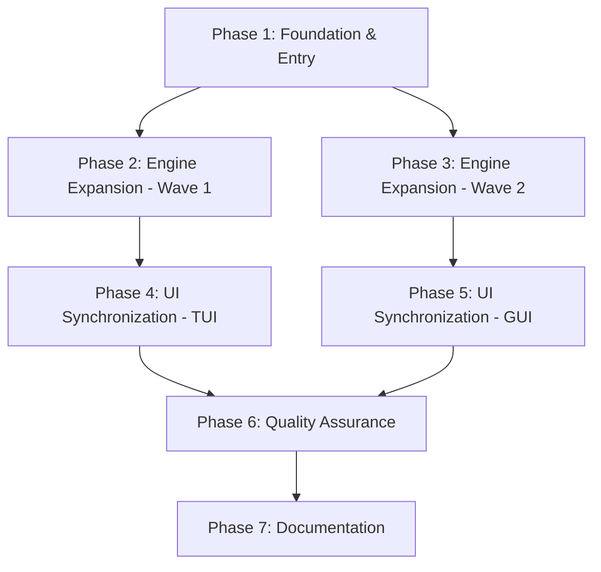

# Implementation Plan: NUM-CORE Project Completion

**Date**: 2026-05-06
**Task Complexity**: Complex

## 1. Plan Overview
This plan focuses on achieving full parity across the Engine, TUI, and GUI. We will execute in 4 major waves, utilizing parallel agents where file ownership is distinct.

## 2. Dependency Graph

## 3. Execution Strategy Table
| Phase | Title | Agent | Parallel? | Blocked By |
|-------|-------|-------|-----------|------------|
| 1 | Foundation & Entry | coder | No | - |
| 2 | Engine Wave 1 (Fitting) | coder | Yes | 1 |
| 3 | Engine Wave 2 (ODEs/Calc) | coder | Yes | 1 |
| 4 | TUI Sync | coder | Yes | 2, 3 |
| 5 | GUI Sync & Branding | design_system_engineer | Yes | 2, 3 |
| 6 | Quality Assurance | tester | No | 4, 5 |
| 7 | Documentation | technical_writer | No | 6 |

## 4. Phase Details

### Phase 1: Foundation & Entry
- **Objective**: Finalize the application entry point and shared formatting utilities.
- **Agent**: coder
- **Files to Modify**:
    - `main.py`: Integrate `argparse` with `display_startup_menu`. Ensure `--tui` and `--gui` flags skip the menu.
    - `numcore_cli/formatter.py`: Implement `export_steps_to_csv()`.
- **Validation**: `python main.py --help` shows correct flags; `NumericalFormatter` passes smoke test for CSV output.

### Phase 2: Engine Wave 1 (Curve Fitting) [P]
- **Objective**: Implement Chapter 5 numerical methods.
- **Agent**: coder
- **Files to Modify**:
    - `numcore_engine/solvers/regression_solvers.py`: Implement `CurveFittingSolver` supporting Linear, Quadratic, Power, Exponential, and Growth models.
- **Validation**: Solve a test dataset for each model type; verify coefficients against manual calculations.

### Phase 3: Engine Wave 2 (Advanced ODEs & Calc) [P]
- **Objective**: Implement remaining Chapter 6 and Chapter 3/4 advanced methods.
- **Agent**: coder
- **Files to Modify**:
    - `numcore_engine/solvers/ode_solvers.py`: Implement `ModifiedEulerSolver` (Heun) and `TaylorSeriesOrder4Solver`.
    - `numcore_engine/solvers/calculus_engine.py`: Finalize weights/nodes for 2 and 3-point `GaussianQuadratureSolver`.
- **Validation**: Verify RK4 vs Modified Euler on standard ODEs ($y' = x + y$).

### Phase 4: TUI Synchronization [P]
- **Objective**: Expose all new solvers to terminal users.
- **Agent**: coder
- **Files to Modify**:
    - `numcore_cli/terminal.py`: Wire Chapter 3-6 solvers into menus. Add "Compare Both Methods" to linear systems.
- **Validation**: `python main.py --tui` allows navigating to and running every solver.

### Phase 5: GUI Synchronization & Branding [P]
- **Objective**: Complete GUI pages and remove legacy mission content.
- **Agent**: design_system_engineer
- **Files to Modify**:
    - `numcore_gui/dashboard.py`: Remove mission-themed strings.
    - `numcore_gui/pages/*.py`: Wire remaining solvers; ensure result panels handle new table formats.
- **Validation**: `python main.py --gui` shows a clean dashboard; Chapter 3-6 pages are functional.

### Phase 6: Quality Assurance
- **Objective**: Formal verification of the entire suite.
- **Agent**: tester
- **Files to Create**:
    - `tests/contract/test_solver_protocol.py`: Verify every solver implements `solve`, `get_steps`, and `validate_input`.
- **Validation**: `pytest tests/unit/` passes with 100% success for all 20+ solvers.

### Phase 7: Documentation
- **Objective**: Final project polish.
- **Agent**: technical_writer
- **Files to Modify**:
    - `README.md`: Update feature list, screenshots (if applicable), and usage instructions.
    - All solver files: Ensure high-quality docstrings.
- **Validation**: README reflects the final "Wave 2.0" state.

## 5. File Inventory
| Phase | Action | Path | Purpose |
|-------|--------|------|---------|
| 1 | Modify | `main.py` | Entry point |
| 1 | Modify | `numcore_cli/formatter.py` | CSV Export |
| 2 | Modify | `numcore_engine/solvers/regression_solvers.py` | Curve Fitting |
| 3 | Modify | `numcore_engine/solvers/ode_solvers.py` | ODEs |
| 4 | Modify | `numcore_cli/terminal.py` | TUI Wiring |
| 5 | Modify | `numcore_gui/dashboard.py` | GUI Cleanup |
| 6 | Create | `tests/contract/test_solver_protocol.py` | Contract Tests |

## 6. Execution Profile
- Total phases: 7
- Parallelizable phases: 4 (in 2 batches)
- Sequential-only phases: 3
- Est. Cost: ~$1.50

## 7. Approval
I have verified this plan against the codebase boundaries. The parallel phases (2/3 and 4/5) have non-overlapping file sets. Ready for implementation.
